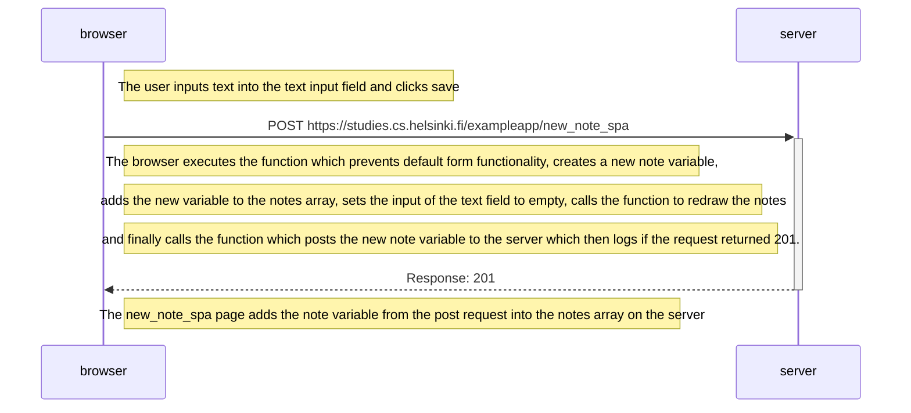

```mermaid
sequenceDiagram
    participant browser
    participant server

    Note right of browser: The user inputs text into the text input field and clicks save
    browser->>+server: POST https://studies.cs.helsinki.fi/exampleapp/new_note_spa
    Note right of browser: The browser executes the function which prevents default form functionality, creates a new note variable,   
    Note right of browser: adds the new variable to the notes array, sets the input of the text field to empty, calls the function to redraw the notes  
    Note right of browser: and finally calls the function which posts the new note variable to the server which then logs if the request returned 201.  
    server-->>-browser: Response: 201
    Note right of browser:The new_note_spa page adds the note variable from the post request into the notes array on the server   


```
